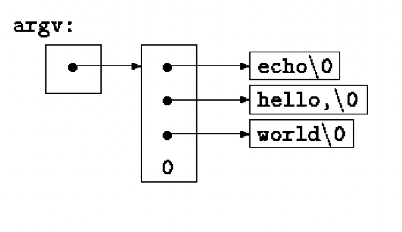
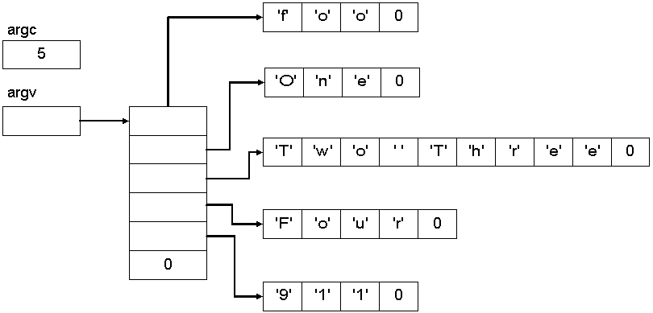
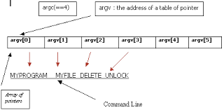

# lesson-9

## COMMAND LINE ARGUMENTS
Pass command-line arguments or parameters to a program when it begins executing:

- argc - argument count, the number of command line argos it was invoked with
- argv - argument vector, pointer to an array of character strings that contain the arguments
	- argv[0] is the name by which the program was invoked, so argc is at least 1.
	- Standard requires that argv[argc] be a null pointer.

Simplest example is the program echo. ```echo hello, world```, prints out hello, world.




#### ARGV EXAMPLE
```c
#include <stdio.h>

// K&R pg. 115
// echo command-line arguments; 1st version

int main(int argc, char *argv[])
{
    int i;

    for (i = 0; i < argc; i++)
    {
        printf("%s%s", argv[i], (i < argc-1) ? " " : "");
    }
    printf("\n");
    return 0;
}
```

How can we make the above more simple?

#### AN ALTERNATIVE ARGV EXAMPLE
```c
#include <stdio.h>

// K&R pg. 115
// echo command-line arguments; 2nd version

int main(int argc, char *argv[])
{
    while (--argc > 0)
       printf((argc >1) ? “%s “ : “%s”, *++argv);
    printf("\n");
    return 0;
}
```
How would you make this include the ./a?

## GREP
- Prints out any line that has the pattern you're looking for.
- ```$./a.exe a < grep.c```
- The standard library function strstr(s, t) returns a pointer to the first occurrence of the string t in the string s, or NULL if there is none. It is declared in <string.h>

```c
#include <stdio.h>
#include <string.h>
#define MAXLINE 1000

int mygetline(char *line, int max);

// K&R pg. 116
// find: print lines that match pattern from 1st arg

int main(int argc, char *argv[])
{
    char line[MAXLINE];
    int found = 0;

    if (argc != 2)
        printf("Usage: find pattern\n");
    else
        while (mygetline(line, MAXLINE) > 0)
        {
            if (strstr(line, argv[1]) != NULL) {
                printf("%s", line);
                found++;
            }
        }
    return found;
}

int mygetline(char s[], int lim)
{
    int c, i;

    i = 0;
    while(--lim > 0 && (c=getchar()) != EOF && c != '\n')
        s[i++] = c;
    if (c == '\n')
        s[i++] = c;
    s[i] = '\0';
    return i;
}
```

## FIND
- Common convention for C programs on UNIX systems is that an argument that begins with a minus sign introduces an optional flag or parameter. 
	- If we chose ```-x``` (print all lines except those that match the pattern) and ```-n``` (print each line preceded by its line number)
		- ```./a.exe -n while < find.c```
	- Optional arguments should be permitted in any order. Furthermore, it is convenient for users if optional arguments can be combined as in: ```-nx```
- In the program below, notice that ```*argv``` points to the pattern. ```*++argv``` is a pointer to an argument string, so ```(*++argv)[0]``` is its first character. An alternate valid form would be ```**++argv```. Brackets[] have higher precedence, so ```*++argv[0]v is a different expression that walks along a specific argument string. ```*++argv[0]``` is the same as ```*++(argv[0])```.





```c
#include <stdio.h>
#include <string.h>
#define MAXLINE 1000

// K&R pg. 117

int mygetline(char *line, int max);

// find:print lines that match pattern from 1st arg
int main(int argc, char *argv[])
{
    char line[MAXLINE];
    long lineno = 0;
    int c, except = 0, number = 0, found = 0;

    while (--argc > 0 && (*++argv)[0] == '-')
    {
        while (c = *++argv[0])
        {
            switch (c) 
            {
                case 'x':
                    except = 1;
                    break;
                case 'n':
                    number = 1;
                    break;
                default:
                    printf("find:illegal option %c\n", c);
                    argc = 0;
                    found = -1;
                    break;
            }
        }
    }
    if (argc != 1)
    {
        printf("Usage:find -x -n pattern\n");
    }
    else
    {
        while (mygetline(line, MAXLINE) > 0)
        {
            lineno++;
            if ((strstr(line, *argv) != NULL) != except) 
            {
                if (number)
                    printf("%ld:", lineno);
                printf("%s", line);
                found++;
            }
        }
    }

    return found;
}


int mygetline(char s[], int lim)
{
    int c, i;

    i = 0;
    while(--lim > 0 && (c=getchar()) != EOF && c != '\n')
        s[i++] = c;
    if (c == '\n')
        s[i++] = c;
    s[i] = '\0';
    return i;
}
```

### Pointers to Functions
- Function is not a variable, but it is possible to define pointers to functions, which can be assigned, placed in arrays, passed to functions, returned by functions, and so on.

#### Sorting algo:
1. Comparison function - determines ordering of any pair
	- We can interchange this based on the type of sort we want
2. Exchange function - reverses order of any pair
	- We can interchange this based on the object we are comparing
3. Sorter - compares and echanges until the objects are in order

If we wanted to switch out the comparison function based on the command line arguments, we can use a pointer to the different functions.

In the example below, we are interchanging a number comparison and a string comparison. Any pointer can be cast to ```(void *)``` and back again without loss of information, so we can call qsort by casting arguments to void *. The elaborate cast of the function argument casts the arguments of the comparison function. These will generally have no effect on actual representation, but assure the compiler that all is well. 
- ```int (*comp) (void*, void*)``` says that comp is a pointer to a function that has two void * arguments and returns an int. The parentheses are important as if we wrote ```int *comp(void*, void *)``` it means comp is a function returning a pointer to an ```int```.
```c
#include <stdio.h>
#include <string.h>

#define MAXLINE 5000 	//max #lines to be sorted
char *lineptr[MAXLINES];	// pointers to text line

int readlines(char *lineptr[], int nlines);
void writelines(char *lineptr[], int nlines);

void qsort(void *lineptr[], int left, int right, int (*comp)(void *, void *));
int numcmp(char *, char *);

//sort input lines
main(int argc, char *argv[]){
	int nlines;		// number of input lines read
	int numeric = 0;	// 1 if numeric sort

	if (argc >1 && strcmp(argv[1], “-n”) == 0)
		numeric =1;
	if ((nlines = readlines(lineptr, MAXLINES)) >= 0) {
	   qsort((void **) lineptr, 0, nlines-1, ( int (*)(void*, void*)) (numeric ? numcmp : strcmp));
	   writelines(lineptr, nlines);
	   return 0;
	} else {
	   printf(“input too big to sort\n”);
	   return 1;
	}
}

// qsort: sort v[left] … v[right] into increasing order
void qsort(void *v[], int left, int right, int (*comp)(void*, void *)) {
	int i, last;
	void swap(void *v[], int, int);
	
	if (left >= right)		// do nothing if array contains fewer than 2 elements
		return;
	swap(v, left, (left, right)/2);
	last = left;
	for (i = left+1; i <= right; i++)
		if ((*comp) (v[i], v[left]) < 0)
			swap(v, ++last, i);
	swap(v, left, last);
	qsort(v, left, last-1, comp);
	qsort(v, last+1, right, comp);
}


#include <stdlib.h>

//numcmp compares s1 and s2 numerically
int numcmp(char *s1, char *s2){
	double v1, v2;
	
	v1 = atof(s1);
	v2 = atof(s2);
	if (v1 < v2)
		return -1;
	else if (v1 >v2)
		return 1;
	else
		return 0;
}

void swap(void *v[], int i, int j;){
	void * temp;
		
	temp = v[i];
	v[i] = v[j];
	V[j] = temp;
}
```

## BASICS OF STRUCTURES
Structure - is a collection of one or more variables, possible of different types, grouped together under a single name for convenient handling.
	- Structures help organize complicated data, particularly in large programs, because they permit a group of related variables to be treated as a unit instead of separate entities
	- Examples: 
		- payroll record for an employee, can have a struct with attributes name, address, social security number, salary, etc. Each one of these attributes can be a struct too as ‘name’ has attributes such as first and last.
		- A point is a pair of coordinates, a rectangle is a pair of points, etc.
```c
struct point {
	int x;
	int y;
};
```

#### Structure components:
	- The keyword struct introduces a structure declaration, which is a list of declarations enclosed in braces.
	- An optional name called a structure tag may follow the word struct (such as point in the example above). 
	- The variables named in a structure are called members.

A structure declaration that is not followed by a list of variables reserves no storage; it merely describes a template or shape of a structure. If the declaration is tagged, the tag can be used later in definitions of instances of the structure.
struct point pt;
Defines a variable pt which is a structure of type struct point.

The structure can be initialized by following its definition with a list of initializers, each a constant expression, for the members:
struct maxpt = {320, 200};

#### POINT EXAMPLE
- Structs basically allow you to create your own complex type.

```c
#include <stdio.h>
#include <math.h>

struct point {
    int x;
    int y;
};

int main()
{
    struct point pt = {-1, 3};
    printf("%d %d\n", pt.x, pt.y);

    double dist;
    dist = sqrt((double)pt.x * pt.x + (double)pt.y * pt.y);
    printf("dist=%f", dist);

    return 0;
}
```

#### RECTANGLE EXAMPLE
	- Shows us that structures can be nested
```c
#include <stdio.h>

struct point {
    int x;
    int y;
};

struct rect {
    struct point pt1;
    struct point pt2;
};

int main()
{
    struct point pt1 = {1, 1};
    struct point pt2 = {3, 3};

    struct rect screen = {pt1, pt2};

    int area;
    area = (screen.pt2.x-screen.pt1.x) * (screen.pt2.y-screen.pt1.y);
    printf("area = %d", area);

    return 0;
}
```

#### STRUCTURES AND FUNCTIONS
The only legal operations on a structure are:
1. copying it
2. assigning to it as a unit
3. taking its address with &
4. accessing its members.


#### POINTER EXAMPLES
- makepoint() takes two integers and returns a point structure
	- The returned value is used to initialize any structure dynamically
```c
#include <stdio.h>
#include <math.h>

struct point {
    int x;
    int y;
};

struct rect {
    struct point pt1;
    struct point pt2;
};

// K&R pg. 130
// makepoint:make a point from x and y components
struct point makepoint(int x, int y)
{
    struct point temp;

    temp.x = x;
    temp.y = y;
    return temp;
}

int main()
{
    struct rect screen;
    struct point middle;
    struct point makepoint(int, int);

    screen.pt1 = makepoint(0, 0);
    screen.pt2 = makepoint(4, 4);
    middle = makepoint((screen.pt1.x + screen.pt2.x)/2, 
                       (screen.pt1.y + screen.pt2.y)/2);

    printf("screen pt1 = %d %d\n", screen.pt1.x, screen.pt1.y);
    printf("screen pt2 = %d %d\n", screen.pt2.x, screen.pt2.y);
    printf("middle = %d %d\n", middle.x, middle.y);

    return 0;
}
```

#### RECT FUNCTIONS
	- Note the #define for min and max
	- Canonicalization = making consistent
```c
#include <stdio.h>
#include <math.h>

struct point {
    int x;
    int y;
};

struct rect {
    struct point pt1;
    struct point pt2;
};

// K&R pg. 130-131
struct point makepoint(int x, int y)
{
    struct point temp;

    temp.x = x;
    temp.y = y;
    return temp;
}

// ptinrect:return 1 if p in r, 0 if not
// defined inside the rectangle as its left and bottom sides but not its top and right sides.
int ptinrect(struct point p, struct rect r)
{
    return p.x >= r.pt1.x && p.x < r.pt2.x
        && p.y >= r.pt1.y && p.y < r.pt2.y;
}

// canonrect: canonicalize coordinates of rectangle; make sure the two coordinates we have of the rectangle are the the bottom left and upper right points

#define min(a, b) ((a) < (b) ? (a) : (b))
#define max(a, b) ((a) > (b) ? (a) : (b))

struct rect canonrect(struct rect r)
{
    struct rect temp;

    temp.pt1.x = min(r.pt1.x, r.pt2.x);
    temp.pt1.y = min(r.pt1.y, r.pt2.y);
    temp.pt2.x = max(r.pt1.x, r.pt2.x);
    temp.pt2.y = max(r.pt1.y, r.pt2.y);

    return temp;
}

int main()
{
    struct rect screen;
    struct point makepoint(int, int);

    screen.pt1 = makepoint(0, 4);
    screen.pt2 = makepoint(4, 0);

    printf("screen pt1 = %d %d\n", screen.pt1.x, screen.pt1.y);
    printf("screen pt2 = %d %d\n", screen.pt2.x, screen.pt2.y);

    struct point inside = {2, 2};
    struct point outside = {5, 5};

    printf("Is (2,2) inside? %d\n", ptinrect(inside, screen));
    printf("Is (5,5) inside? %d\n", ptinrect(outside, screen));


    printf("after canonicalization\n");
    screen = canonrect(screen);
    printf("screen pt1 = %d %d\n", screen.pt1.x, screen.pt1.y);
    printf("screen pt2 = %d %d\n", screen.pt2.x, screen.pt2.y);

    printf("Is (2,2) inside? %d\n", ptinrect(inside, screen));
    printf("Is (5,5) inside? %d\n", ptinrect(outside, screen));

    return 0;
}
```
 
## STRUCTS & PTRS
If a large structure is to be passed to a function, it is generally more efficient to pass a pointer than to copy the whole structure. Structure pointers are just like pointers to ordinary variables. The declaration 

```struct point *pp;```

Says that pp is a pointer to a structure of type struct point. If pp points to a point structure, ```*pp``` is the structure, and ```(**p).x``` and ```(*pp).y``` are the members. 
Pointers to structures are so frequently used that an alternative notation is provided as shorthand. If p is a pointer to a structure, then p-> member-of-structure refers to the particular member.
```c
#include <stdio.h>
 
// K&R pg. 131
 
struct point {
    int x;
    int y;
};
 
struct rect {
    struct point pt1;
    struct point pt2;
};
 
int main()
{
    struct point pt1 = {1, 2};
    struct point pt2 = {3, 4};
 
    struct rect screen = {pt1, pt2};
 
    struct point *pp;
    pp = &pt1;
 
    printf("pt1=(%d, %d)\n", (*pp).x, (*pp).y);
    // . is a higher precedence than *
 
    printf("Using ->: pt1=(%d, %d)\n", pp->x, pp->y);
 
    struct rect *rp = &screen;
 
    printf("screen.x=%d\n", screen.pt1.x);
    printf("screen.x=%d\n", rp->pt1.x);
    printf("screen.x=%d\n", (screen.pt1).x);
    printf("screen.x=%d\n", (rp->pt1).x);
 
    return 0;
}
```
 
#### STRUCT POINTER PRECEDENCE
The structure operators . and ->, together with () for function calls and [ ] for subscripts, are at the top of the precedence hierarchy and thus bind very tightly. So for the declaration 
```c
struct {
int len;
char *str;
} *p;
```
Then, ```++p -> len``` increments ```len```, not ```p```, because the implied parenthesization is ```++(p->len)```. In the same way, ```*p->str``` fetches whatever str points to; v*p->str++``` increments str after accessing whatever it points to (just like ```*s++```); ```(*p->str)++``` increments whatever ```str``` points to; and ```*p++->str``` increments ```p``` after accessing whatever ```str``` points to.
```c
#include <stdio.h>
 
struct String{
    int len;
    char *str;
};
 
int main()
{
    struct String s;
    s.len = 5;
    s.str = "Cool";
 
    printf("s string: %s, len: %d\n", s.str, s.len);
 
    struct String *p;
    p = &s;
    p->str = "COOL";
 
    ++p->len; // same as ++(p->len)
    printf("s string: %s, len: %d\n", s.str, s.len);
 
    // commented out as it will mess up the following code
    // (++p)->len; // increments p before accessing len
    printf("s string: %s, len: %d\n", s.str, s.len);
    printf("p string: %s, len: %d\n", p->str, p->len);
 
    char c = *p->str; // fetches whatever str points to
    printf("c=%c\n", c);
 
    *p->str++;
    printf("s string: %s, len: %d\n", s.str, s.len);
    printf("p string: %s, len: %d\n", p->str, p->len);
 
    return 0;
}
```

- Be careful with pointers!!!

## ARRAYS OF STRUCTURES
 Program to count the occurrences of each C keyword:
	- What data do we need to store?
	- How should we store this data?
Perhaps as a struct like shown below?

```c
struct key {
	char *word;
	int count;
} keytab[NKEYS];
```

#### DECLARATIONS
- We use an array of structs below, and initialize it when it is defined as it contains a constant set of names. The structure initialization is analogous to earlier ones - the definition is followed by a list of initializers enclosed in braces. The initializers are listed in pairs corresponding to the structure members
 
Struct array declared like any other type array.

```c
#include <stdio.h>
 
struct key {
    char *word;
    int count;
};
 
int main()
{
    struct key keytab[] = {
        "auto", 0,
        "break", 0,
        "case", 0,
        "char", 0,
        "const", 0,
        "continue", 0,
        "default", 0,
        /* ... */
        "unsigned", 0,
        "void", 0,
        "volatile", 0,
        "while", 0
    };
 
    printf("word[2]=%s count[2]=%d", keytab[2].word, keytab[2].count);
 
    return 0;
}
```

#### KEYWORD COUNTING
- Main routine reads the input by repeatedly calling a function getword that fetches one word at a time. Each word is looked up in the keytab struct through the binary search function. The list of keywords must be sorted in increasing order in the table.

```c
#include <stdio.h>
#include <ctype.h>
#include <string.h>
 
#define MAXWORD 100
 
struct key {
    char *word;
    int count;
} keytab[] = {
        "auto", 0,
        "break", 0,
        "case", 0,
        "char", 0,
        "const", 0,
        "continue", 0,
        "default", 0,
        /* ... */
        "unsigned", 0,
        "void", 0,
        "volatile", 0,
        "while", 0
};

/*sizeof cannot be used in a #if line, bc the preprocessor does not parse type names. But the expression in the #define is not evaluated by the preprocessor, so the code here is legal. We could have also written this as 
#define NKEYS (sizeof keytab / sizeof sizeof(struct key))
But this is less general as it depends on the type of keytab.
*/
#define NKEYS (sizeof keytab / sizeof keytab[0])
 
int getword(char *, int);
int binsearch(char *, struct key *, int);
int getch(void);
void ungetch(int);
 
 
// K&R Pg. 134-136
// count C keywords
 
int main()
{
    int n;
    char word[MAXWORD];
 
    while (getword(word, MAXWORD) != EOF)
        if (isalpha(word[0]))
            if ((n = binsearch(word, keytab, NKEYS)) >= 0)
                keytab[n].count++;
 
    for (n = 0; n < NKEYS; n++)
        if (keytab[n].count > 0)
            printf("%4d %s\n",
                keytab[n].count, keytab[n].word);
 
    return 0;
}
 
// binsearch: find word in tab[0]...tab[n-1
int binsearch(char *word, struct key tab[], int n)
{
    int cond;
    int low, high, mid;
 
    low = 0;
    high = n - 1;
    while (low <= high) {
        mid = (low + high) / 2;
        if ((cond = strcmp(word, tab[mid].word)) < 0)
            high = mid - 1;
        else if (cond > 0)
            low = mid + 1;
        else
            return mid;
    }
 
    return -1;
}
 
// getword:get next word or character from input
 
int getword(char *word, int lim)
{
    int c, getch(void);
    void ungetch(int);
    char *w = word;
 
    while (isspace(c = getch()))
        ;
 
    if (c != EOF)
        *w++ = c;
    if (!isalpha(c)) {
        *w = '\0';
        return c;
    }
 
    for ( ; --lim > 0; w++)
	//isalnum identifies letters and digits, from <ctype.h>
        if (!isalnum(*w = getch())) {
            ungetch(*w);
            break;
        }
 
    *w = '\0';
 
    return word[0];
}
 
// K&R pg. 79
#define BUFSIZE 100
 
char buf[BUFSIZE]; // buffer for ungetch
int bufp = 0; // next free position in buf
 
int getch(void) // get a (possibly pushed back) character
{
    return (bufp > 0) ? buf[--bufp] : getchar();
}
 
void ungetch(int c) // push character back on input
{
    if (bufp >= BUFSIZE)
        printf("ungetch: too many caracters\n");
    else
        buf[bufp++] = c;
}
```

# Homework
The C Programming Language, 2nd Edition - Kerninghan & Ritchie
Chapter 5.10-5.11, 6.1-6.3

